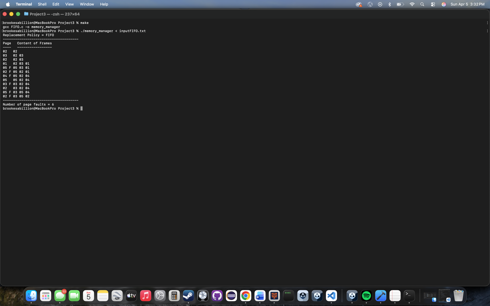

# Virtual Memory Manager

A C implementation of the FIFO page replacement algorithm used to simulate virtual memory management in an operating system.

## What I Learned

This project strengthened my understanding of virtual memory, page replacement strategies, memory management, and systems programming in C. Building the FIFO page replacement algorithm gave me hands-on experience implementing core operating systems concepts and working with low-level program logic.

## Features

- Simulates page replacement using the FIFO algorithm
- Tracks page faults during execution
- Displays memory frame contents after each page reference
- Built with standard C
- Includes a Makefile for easy compilation

## Technologies

- C
- GCC
- Make
- Operating Systems

## Building

Compile the project with:

```bash
make
```

Run the program:

```bash
./memory_manager
```

## Example Output



## Author

Brookes Gonzales
